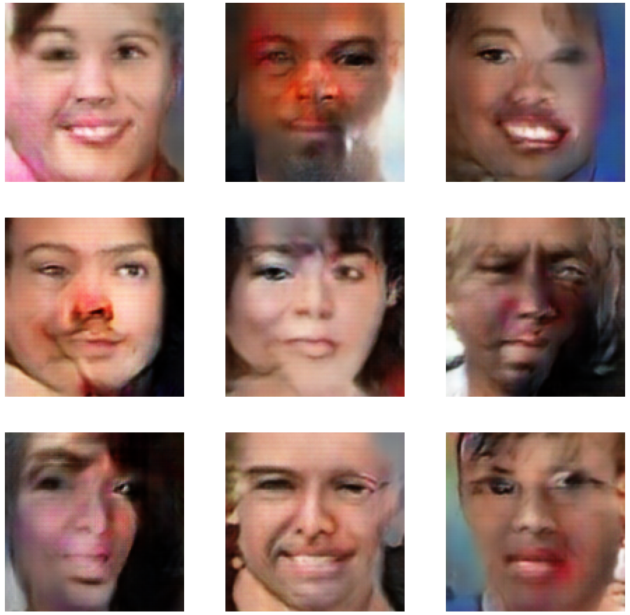
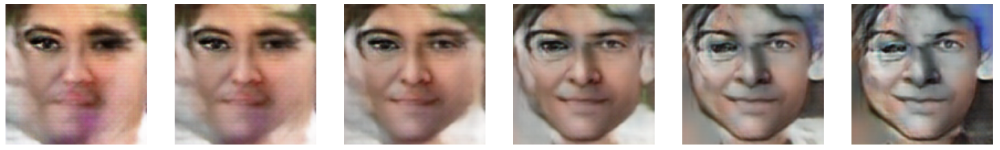
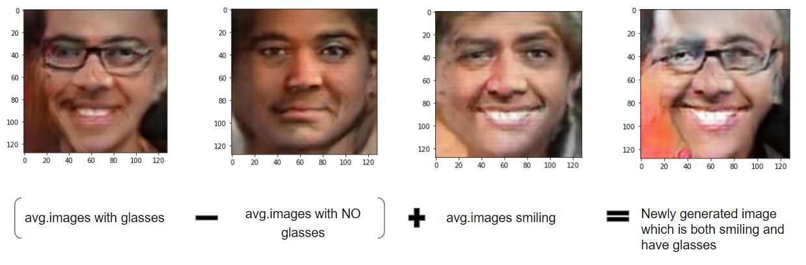

# Latent Variables in Computer Vision

## Generative Modeling

The goal of deep generative models is to take as input a training sample from some distribution and learn a model that represents that distribution.

For instance, if ```**P<sub>data</sub>(x)** ``` is the probablity distribution of the training data, our goal is to learn a probablity distribution ``` **P<sub>model</sub>(x)** ``` which is similar to ``` **P<sub>data</sub>(x)** ```.

A good generative model should have the following two capabilities:
1. It should be able to generate a random new image which not present in the training dataset, but looks similar to the training data images.
2. They should be able to alter or explore variations on the data we already have in specific direction.

To satisfy the second capability, a generative model should have a continous latent space which will allow for smooth interpolation.

Next we will take a look at some of the generative models used in field of computer vision.

### AutoEncoder (AE)

AutoEncoders uses an unsupervised approach for learning a lower-dimensional feature representation from unlabeled training data. The encoder block learns the mapping from the input data to a low-dimensional latent space **z**. Having a low dimensional latent space allows to compress the data into small latent vector which learns a very compact enrich feature representation. Decoder learns mapping back from latent space **z**, to a reconstruct the original data. 

Autoencoders are trained using the reconstruction loss, where we compare the difference between the orginal image and the reconstructed image from the decoder. The reconstruction loss forces the latent representation to capture as much "information" about the data as possible.


**Limitation**:
- AE learns a deterministic encoding, where for a given latent vector it will always generate the same output. This is not a very desirable feature for generative models, as we want our model to generate new images and not the direct reconstruction of the orginal data.
- Latent space is not continous. Because of this smooth interpolation is not possible and hence the capability to generate new images are limited.
- There are empty spaces in the latent spaces. If a point from this empty space is given as input to the decoder it will generate unrealistic outputs.

### Variational AutoEncoder (VAE)

Variational AutoEncoder overcomes the deterministic nature of AE by replacing the deterministic latent space **z** with a stochastic sampling operation. Instead of learning a single latent vector **z**, for each input image, VAE learns a mean vector and a standard deviation vector. It then samples from this mean and standard deviation to compute the latent sample **z**. So during the training of a VAE, for the same input image, different latent vectors are sampled from the distribution (mean & std). This means there is no longer a one to one mapping between the input image and a point in latent space. Every input image is mapped to a distibution in the latent space. This also ensure that the latent space created by VAE will be continous and thus enables the smooth interpolation.   


#### Latent space of AE and VAE

Below is a figure showing the latent space of AE and VAE for the MNIST dataset. As we can see the latent space of AE is not continous and there are empty regions between the datapoints in various classes. And it have minimal overlap. Compared to this, the latent space of VAE  is more continous and have overlapping regions. This allows for smooth interpolation in the latent space.


### Generative Adveserial Networks (GAN)

So far in both AE and VAE, we input the image data to the encoder and during training we try to model the underlying distribution of the data. However, one of the major limitation of such model is we cannot directly sample from these complex distributions learned by the model. 
In GAN, we don't explicitly model the underlying distribution of the data. Instead, we learn a representation that can be sucessful in generating new instances which are similar to the training data. Here we sample from something simple (eg:noise) and learn a functional transformation to the training data distribution. By learning this functional transformation, we can then sample to generate fake instances which will be similar to the training data distribution. 


GAN have 2 neural networks: Generator and Discriminator. 
**Generator** takes as input the random noise and converts it into a fake data instance.
**Discriminator** tries to identify real data from fake instances created by the generator.
During training these 2 networks compete against each other. Discriminator will be trained to improve its capability to identify fake images. This will force the generator to improve and in turn create fake instances which are more similar to the original training data distribution.


### My experiments with GAN Latent Space

***Dataset***

For training GAN, I used UTKFace dataset containing over 23000 images of faces of humans beloning to different ethinic group, age, gender, expressing different emotions etc. While training I have used only 15000 images from this dataset. All the images in the dataset are color images with the resoultion 128 x 128.

The model was trained for 100 epochs.

***Generator Architecture***

In my experiments I have used the latent space (noise) dimension as 100. So the generator neural network will take as input a 100 dimensional random vector generated from a standard normal distribution and it outputs a 128 x 128 x 3 image.

```python
def generator(latent_dimension):
    model = Sequential()
    nodes = 128 * 8 * 8
    model.add(Dense(nodes, input_dim=latent_dimension))
    model.add(LeakyReLU(alpha=0.2))
    model.add(Reshape((8, 8, 128)))
    model.add(Conv2DTranspose(128, (4, 4), strides=(2, 2), padding='same'))
    model.add(LeakyReLU(alpha=0.2))
    model.add(Conv2DTranspose(128, (4, 4), strides=(2, 2), padding='same'))
    model.add(LeakyReLU(alpha=0.2))
    model.add(Conv2DTranspose(128, (4, 4), strides=(2, 2), padding='same'))
    model.add(LeakyReLU(alpha=0.2))
    model.add(Conv2DTranspose(128, (4, 4), strides=(2, 2), padding='same'))
    model.add(LeakyReLU(alpha=0.2))
    model.add(Conv2D(3, (8, 8), activation='tanh', padding='same'))
    return model
```

***Discriminator Architecture***

The discriminator network is a binary classifier which takes as input an image of resoultion 128 x 128 x 3 and predict whether the image is fake or real. Disciminator network I have used multiple convolution layers. 

```python
def discriminator(input_shape=(128, 128, 3)):
    
    model = Sequential()
    model.add(Conv2D(128, (3, 3), padding='same', input_shape=input_shape))
    model.add(LeakyReLU(alpha=0.2))
    model.add(Conv2D(128, (3, 3), strides=(2, 2), padding='same'))
    model.add(LeakyReLU(alpha=0.2))
    model.add(Conv2D(128, (3, 3), strides=(2, 2), padding='same'))
    model.add(LeakyReLU(alpha=0.2))
    model.add(Conv2D(128, (3, 3), strides=(2, 2), padding='same'))
    model.add(LeakyReLU(alpha=0.2))
    model.add(Conv2D(128, (3, 3), strides=(2, 2), padding='same'))
    model.add(LeakyReLU(alpha=0.2))
    model.add(Flatten())
    model.add(Dropout(0.4))
    model.add(Dense(1, activation='sigmoid'))
    optimizer = Adam(learning_rate=0.0002, beta_1=0.5)
    model.compile(loss='binary_crossentropy', optimizer=optimizer, metrics=['accuracy'])
    
    return model
```

Link to code (Training) : [GAN Training](https://github.com/raigon44/xai.github.io/blob/main/gan-latentspace.ipynb)

To see the saved version of the notebook in Kaggle, kindly check the below link.

Link to Kaggle Notebook (Training) : [GAN-Training](https://www.kaggle.com/code/raigon13/gan-latentspace/notebook)

After training, I saved the generator model to conduct further experiments.

***Generating fake images using Generator***

Here I have generated 9 distinct 100 dimensional random points from a standard normal distribution and input this into the the generator network. The resulting fake images are shown below. The images generated by the Generator network are totally new and is not present in the training dataset. A bigger generator model trained for longer time will be able to generate images that are more similar to the orginal UTKFace dataset.



***Linear Interpolation***

Here I generated 2 random 100 dimensional points from a standard normal distribution and interpolate between them in the latent space with 6 steps (including the starting and final points). The points in the latent space corresponding to these 6 points are fed to the generator model to create 6 images that tell us the correspoing transformation in the learned target data distribution space. The below figure shows an example for this transformation.




***Generating new images with specific features***

To perform this experiment, I generated 100 fake images using the generator model. From these 100 fake images, I manually checked for faces with glasses, without glasees and face that have a possitive emotion. I found 3 images belonging to each of these three group. Next I retrieved the 100-dimensional vector corresponding to these images and calculated the average for each group. 

To obtain the "vector" representing "glasses", I subracted the average vector corresponding to the group of images containing glasses from the group of images containing no glasses. This result vector was added to the average vector of images smilling to generate a new image which is both smilling and have glasses.




Link to code (Experiments): [Latent VAR walks](https://github.com/raigon44/xai.github.io/blob/main/latent-var-walks.ipynb)

To see the saved version of the notebook in Kaggle, kindly check the below link.

Link to Kaggle Notebook (Experiments) : [Laten-VAR-walks](https://www.kaggle.com/code/raigon13/latent-var-walks/notebook)


### Other tools for exploring latent space

Other methodologies where introduced to explore the latent space of GAN to control images generated. In the below sub-sections contains links to the orginal paper and to the tools.

#### Latent Compass

Latent compass is a tool that maps an experience onto a latent direction so one can repeat the experience by moving in that direction from any starting place.

[Latent Compass Tool](http://latentcompass.com/#/?class=306)

[Paper](https://arxiv.org/abs/2012.14283)

[Introductory video](https://www.youtube.com/watch?v=50fzBwa9Z1I)

#### Steerable GAN

[Paper](https://arxiv.org/pdf/1907.07171)

[Colab Notebook provided by authors](https://colab.research.google.com/drive/1-8RXAcwQXiLsocNQoOnm9uDsEvr34Bqa?usp=sharing)

#### GANalyze

[Paper](https://scholar.google.com/scholar?output=instlink&q=info:VHLJcZQ82sIJ:scholar.google.com/&hl=en&as_sdt=0,5&scillfp=2454665381828472632&oi=lle)

[GANalyze tool](http://ganalyze.csail.mit.edu/)


### References

[Intuitively Understanding Variational Autoencoders](https://towardsdatascience.com/intuitively-understanding-variational-autoencoders-1bfe67eb5daf)

[Towards an Interpretable Latent Space](https://thilospinner.com/towards-an-interpretable-latent-space/)

[Deep Generative Modeling](http://introtodeeplearning.com/slides/6S191_MIT_DeepLearning_L4.pdf)

[Exploring GAN Latent Space](https://www.youtube.com/watch?v=iuQ_f3W5Ttk&t=0s)


