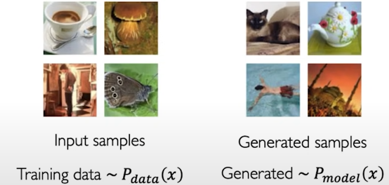
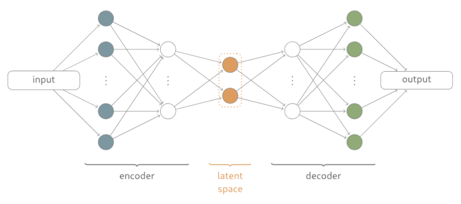
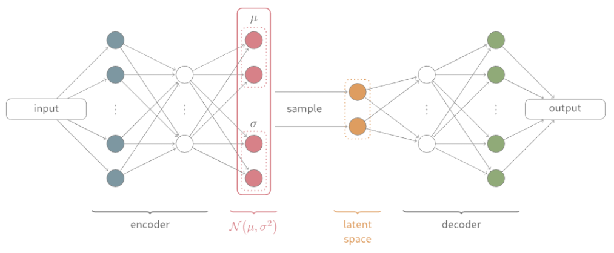
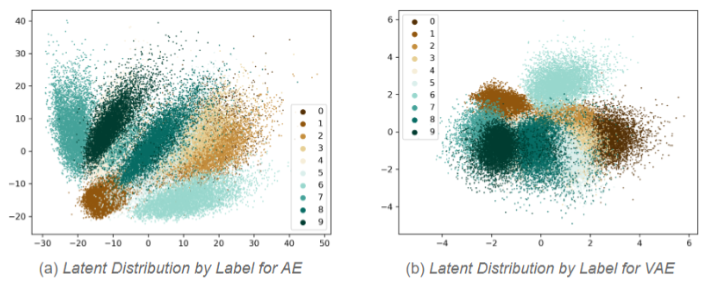
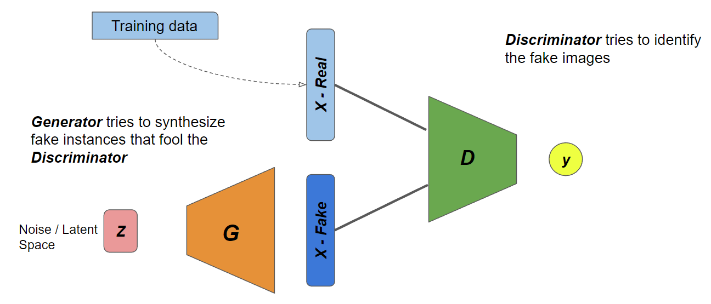

# Latent Variables in Computer Vision

## Generative Modeling

The goal of deep generative models is to take as input a training sample from some distribution and learn a model that represents that distribution.

For instance, if **P<sub>data</sub>(x)** is the probablity distribution of the training data, our goal is to learn a probablity distribution **P<sub>model</sub>(x)** which is similar to **P<sub>data</sub>(x)**.



A good generative model should have the following two capabilities:
1. It should be able to generate a random new image which not present in the training dataset, but looks similar to the training data images.
2. They should be able to alter or explore variations on the data we already have in specific direction.

To satisfy the second capability, a generative model should have a continous latent space which will allow for smooth interpolation.

Next we will take a look at some of the generative models used in field of computer vision.

### AutoEncoder (AE)

AutoEncoders uses an unsupervised approach for learning a lower-dimensional feature representation from unlabeled training data. The encoder block learns the mapping from the input data to a low-dimensional latent space **z**. Having a low dimensional latent space allows to compress the data into small latent vector which learns a very compact enrich feature representation. Decoder learns mapping back from latent space **z**, to a reconstruct the original data. 

Autoencoders are trained using the reconstruction loss, where we compare the difference between the orginal image and the reconstructed image from the decoder. The reconstruction loss forces the latent representation to capture as much "information" about the data as possible.



**Limitation**:
- AE learns a deterministic encoding, where for a given latent vector it will always generate the same output. This is not a very desirable feature for generative models, as we want our model to generate new images and not the direct reconstruction of the orginal data.
- Latent space is not continous. Because of this smooth interpolation is not possible and hence the capability to generate new images are limited.
- There are empty spaces in the latent spaces. If a point from this empty space is given as input to the decoder it will generate unrealistic outputs.

### Variational AutoEncoder (VAE)

Variational AutoEncoder overcomes the deterministic nature of AE by replacing the deterministic latent space **z** with a stochastic sampling operation. Insteand of learning a single latent vector **z**, for each input image, VAE learns a mean vector and a standard deviation vector. It then samples from this mean and standard deviation to compute the latent sample **z**. So during the training of a VAE, for the same input image, different latent vectors are sampled from the distribution (mean & std). This means there is no longer a one to one mapping between the input image a latent space. Every input image is mapped to a distibution in the latent space. This also ensure that the latent space created by VAE will be continous and thus enables the smooth interpolation.   



#### Latent space of AE and VAE

Below is a figure showing the latent space of AE and VAE for the MNIST dataset. As we can see the latent space of AE is not continous and there are empty regions between the datapoints in various classes. And it have minimal overlap. Compared to this, the latent space of VAE  is more continous and have overlapping regions. This allows for smooth interpolation in the latent space.



### Generative Adveserial Networks (GAN)

So far in both AE and VAE, we input the image data to the encoder and during training we try to model the underlying distribution of the data. However, one of the major limitation of such model is we cannot directly sample from these complex distributions learned by the model. 
In GAN, we don't explicitly model the underlying distribution of the data. Instead, we learn a representation that can be sucessful in generating new instances which are similar to the training data. Here we sample from something simple (eg:noise) and learn a transformation to the training data distribution.



Key idea
Figure
Generation process

#### My experiments with the latent space of GAN 

###### Training a GAN network

- Dataset
- Generator architecture
- Discriminator architecture
- Training details

Link to the Kaggle Notebook

- Generating new images
- Linear interpolation
- Controlling the generation
- v ector calculation

Link to the kaggle Notebook

### Other tools for exploring latent space

##### Latent Compass

##### Steerable GAN


### Further Readings


You can use the [editor on GitHub](https://github.com/raigon44/xai.github.io/edit/main/README.md) to maintain and preview the content for your website in Markdown files.

Whenever you commit to this repository, GitHub Pages will run [Jekyll](https://jekyllrb.com/) to rebuild the pages in your site, from the content in your Markdown files.

### Markdown

Markdown is a lightweight and easy-to-use syntax for styling your writing. It includes conventions for

```markdown
Syntax highlighted code block

# Header 1
## Header 2
### Header 3

- Bulleted
- List

1. Numbered
2. List

**Bold** and _Italic_ and `Code` text

[Link](url) and 
```

For more details see [Basic writing and formatting syntax](https://docs.github.com/en/github/writing-on-github/getting-started-with-writing-and-formatting-on-github/basic-writing-and-formatting-syntax).

### Jekyll Themes

Your Pages site will use the layout and styles from the Jekyll theme you have selected in your [repository settings](https://github.com/raigon44/xai.github.io/settings/pages). The name of this theme is saved in the Jekyll `_config.yml` configuration file.

### Support or Contact

Having trouble with Pages? Check out our [documentation](https://docs.github.com/categories/github-pages-basics/) or [contact support](https://support.github.com/contact) and we’ll help you sort it out.
